# 💰 Daily Expense Tracker

A comprehensive Python application for tracking daily expenses with advanced features including income tracking, budget management, recurring expenses, and data visualization.


---

## 📋 Table of Contents

- [Features](#features)
- [Quick Start](#quick-start)
- [Project Structure](#project-structure)
- [Usage](#usage)
- [Database Schema](#database-schema)
- [Output Examples](#output-examples)
- [Screenshots](#screenshots)
- [Development](#development)
- [Dependencies](#dependencies)
- [Future Enhancements](#future-enhancements)
- [Contributing](#contributing)
- [License](#license)
- [Support](#support)

---

## ✨ Features

### 📊 Core Features

| Feature | Description |
|---------|-------------|
| **Expense Management** | Add, view, update, delete expenses with 8 categories |
| **Income Tracking** | Record and manage multiple income sources (Salary, Bonus, Freelance, etc.) |
| **Budget Management** | Set monthly budgets per category with progress tracking |
| **Recurring Expenses** | Automate recurring bills and subscriptions |
| **Monthly Analysis** | Category breakdowns with percentages and trends |
| **Data Visualization** | Pie charts and trend charts for expense distribution |
| **Export Functionality** | CSV, Excel, and JSON export options |
| **Data Backup & Restore** | Local backup system with restore capability |
| **Tags & Labels** | Add custom tags to expenses for better organization |
| **Payment Methods** | Track payment methods (Cash, Credit Card, E-Wallet, etc.) |

### 🎨 User Interfaces

- **CLI Version** - Full-featured command-line interface with 12 menu options
- **GUI Version** - Modern dark-themed graphical interface with 6 tabs
- **Interactive Charts** - Pie charts and trend visualizations
- **Real-time Dashboard** - Live stats with Total Expense, Income, and Net Balance

### 🛠️ Technical Features

- **Layered Architecture** - Models-Services-Utils separation
- **Database** - SQLite with 5 optimized indexes for performance
- **Multiple Interfaces** - CLI and GUI in one application
- **Testing** - 277 test cases with 100% pass rate
- **Code Quality** - Black formatting, Flake8 linting, 100% coverage

---

## 🚀 Quick Start

### Installation

```bash
# 1. Clone repository
git clone https://github.com/ArkanTsabit123/Daily-Expense-Tracker.git
cd Daily-Expense-Tracker

# 2. Create virtual environment
python -m venv venv

# 3. Activate virtual environment
# Windows:
venv\Scripts\activate
# Mac/Linux:
source venv/bin/activate

# 4. Install dependencies
pip install -r requirements.txt

# 5. Run application
python run.py          # Launcher (choose CLI or GUI)
python cli.py          # CLI version only
python gui.py          # GUI version only
```

### Generate Sample Data (Optional)

```bash
# Generate 100 dummy expenses with sample data
python utils/dummy_data.py --preview

# Generate 200 expenses, 6 months back
python utils/dummy_data.py -n 200 -m 6 --preview
```

---

## 📁 Project Structure

```
Daily-Expense-Tracker/
├── 📁 config/
│   └── database_config.py          # Database configuration
├── 📁 models/
│   ├── expense_model.py            # Expense data model
│   └── category_model.py           # Category data model
├── 📁 services/
│   ├── database_service.py         # Database operations layer
│   ├── expense_service.py          # Business logic layer
│   └── export_service.py           # Export functionality
├── 📁 utils/
│   ├── validation.py               # Input validation
│   ├── date_utils.py               # Date helper functions
│   ├── formatters.py               # Data formatting
│   ├── exceptions.py               # Custom exceptions
│   └── dummy_data.py               # Sample data generator
├── 📁 visualization/
│   └── chart_service.py            # Chart generation
├── 📁 tests/                       # Test files (6 test modules)
├── 📁 backups/                     # Database backups (auto-created)
├── 📁 exports/                     # Exported files (auto-created)
├── 📁 charts/                      # Generated charts (auto-created)
├── 📁 logs/                        # Application logs (auto-created)
├── 📁 data/                        # Database storage
│   └── expenses.db                 # SQLite database
├── cli.py                          # CLI application (66KB)
├── gui.py                          # GUI application (103KB)
├── run.py                          # Application launcher
├── main.py                         # Entry point
├── requirements.txt                # Dependencies
├── check_db.py                     # Database inspection tool
├── reset_db.py                     # Database reset tool
└── README.md                       # Documentation
```

---

## 🎮 Usage

### CLI Version

Run the CLI application:
```bash
python cli.py
```

**Main Menu Options:**
```
📊 EXPENSE TRACKING
1. ➕ Add Expense
2. 📜 View History (with filters)
3. 📊 Summary (All Time / Monthly / Yearly)
4. 📈 Generate Chart

💰 FINANCE MANAGEMENT
5. 💵 Add Income
6. 📋 View Income
7. 🎯 Budget Management
8. 🔄 Recurring Expenses

📊 ANALYTICS & TOOLS
9. 📈 Advanced Analytics
10. 📤 Export Data
11. 💾 Backup & Restore

❌ EXIT
12. ❌ Exit
```

### GUI Version

Run the GUI application:
```bash
python gui.py
```

**GUI Features:**
- **Dashboard** - Real-time expense, income, and net balance stats
- **Budget Tab** - Set and track monthly budgets with progress bars
- **Income Tab** - Record and manage income sources
- **Recurring Tab** - Manage recurring expenses
- **Analytics Tab** - Advanced charts and trend analysis
- **Settings Tab** - Backup, restore, and export options

### Example Usage

**Add an expense:**
```bash
python cli.py
> Select option 1 (Add Expense)
> Date: 2026-07-02
> Category: Food
> Amount: 50000
> Description: Lunch
> Payment Method: Cash
> Tags: lunch, work
```

**Add income:**
```bash
> Select option 5 (Add Income)
> Date: 2026-07-01
> Source: Salary
> Amount: 5000000
> Description: July salary
> Recurring: Yes
```

---

## 🗄️ Database Schema

The application uses SQLite with the following tables and indexes:

### Tables

**Expenses Table:**
```sql
CREATE TABLE expenses (
    id INTEGER PRIMARY KEY AUTOINCREMENT,
    date TEXT NOT NULL,
    category TEXT NOT NULL,
    amount REAL NOT NULL,
    description TEXT,
    payment_method TEXT DEFAULT 'Cash',
    created_at TEXT DEFAULT CURRENT_TIMESTAMP
);
```

**Incomes Table:**
```sql
CREATE TABLE incomes (
    id INTEGER PRIMARY KEY AUTOINCREMENT,
    date TEXT NOT NULL,
    source TEXT NOT NULL,
    amount REAL NOT NULL,
    description TEXT,
    is_recurring INTEGER DEFAULT 0,
    created_at TEXT DEFAULT CURRENT_TIMESTAMP
);
```

**Budgets Table:**
```sql
CREATE TABLE budgets (
    id INTEGER PRIMARY KEY AUTOINCREMENT,
    category TEXT NOT NULL UNIQUE,
    monthly_limit REAL NOT NULL,
    created_at TEXT DEFAULT CURRENT_TIMESTAMP
);
```

**Recurring Expenses Table:**
```sql
CREATE TABLE recurring_expenses (
    id INTEGER PRIMARY KEY AUTOINCREMENT,
    category TEXT NOT NULL,
    amount REAL NOT NULL,
    description TEXT,
    frequency TEXT NOT NULL,
    start_date TEXT NOT NULL,
    end_date TEXT,
    active INTEGER DEFAULT 1,
    created_at TEXT DEFAULT CURRENT_TIMESTAMP
);
```

**Expense Tags Table:**
```sql
CREATE TABLE expense_tags (
    id INTEGER PRIMARY KEY AUTOINCREMENT,
    expense_id INTEGER NOT NULL,
    tag TEXT NOT NULL,
    FOREIGN KEY (expense_id) REFERENCES expenses(id)
);
```

### Database Indexes

```sql
-- Optimized queries for performance
CREATE INDEX idx_expenses_date ON expenses(date);
CREATE INDEX idx_expenses_category ON expenses(category);
CREATE INDEX idx_expenses_date_category ON expenses(date, category);
```

---

## 📊 Output Examples

### CLI - All Time Summary (Real Data)

```
📊 ALL TIME SUMMARY
==================================================
Total Expense  : Rp 18,262,000
Total Income   : Rp 32,990,000
Net Balance    : Rp 14,728,000
Transactions   : 100
Categories     : 8
Period         : 2026-04-01 to 2026-07-06
==================================================

📂 Category Breakdown:
--------------------------------------------------
Education               Rp  5,349,000 (29.3%) ████████████████
Bills                   Rp  3,911,000 (21.4%) ███████████
Shopping                Rp  2,848,000 (15.6%) ████████
Food                    Rp  1,624,000 (8.9%)  █████
Health                  Rp  2,509,000 (8.9%)  █████
Entertainment           Rp  1,089,000 (6.0%)  ███
Other                   Rp    586,000 (3.2%)   ██
Transport               Rp    346,000 (1.9%)   █
```

### CLI - Budget Overview

```
📊 BUDGET OVERVIEW
==================================================
Period: July 2026

📂 Bills
   Limit : Rp 3,000,000
   Spent : Rp 1,200,000
   Left  : Rp 1,800,000
   [████████░░░░░░░░░░░░░░] 40.0%  🟢 ON TRACK

📂 Food
   Limit : Rp 2,000,000
   Spent : Rp 800,000
   Left  : Rp 1,200,000
   [████░░░░░░░░░░░░░░░░░░] 40.0%  🟢 ON TRACK
```

### GUI Dashboard (Real Data)

```
💰 Expense Dashboard
======================================================================
Total Expense  : Rp 18,262,000
Total Income   : Rp 32,990,000
Net Balance    : Rp 14,728,000
Categories     : 8
Avg/Day        : Rp 50,000
Top Category   : Education (Rp 5,349,000)
Transactions   : 100
```

---

## 📸 Screenshots

### 🖥️ GUI Interface

| Dashboard | Budget Management |
|-----------|-------------------|
| 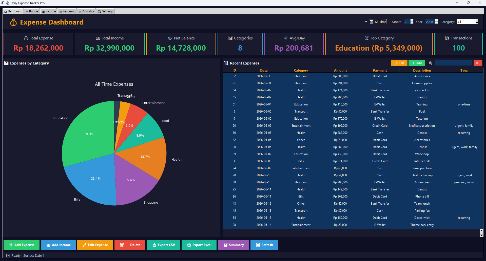 | 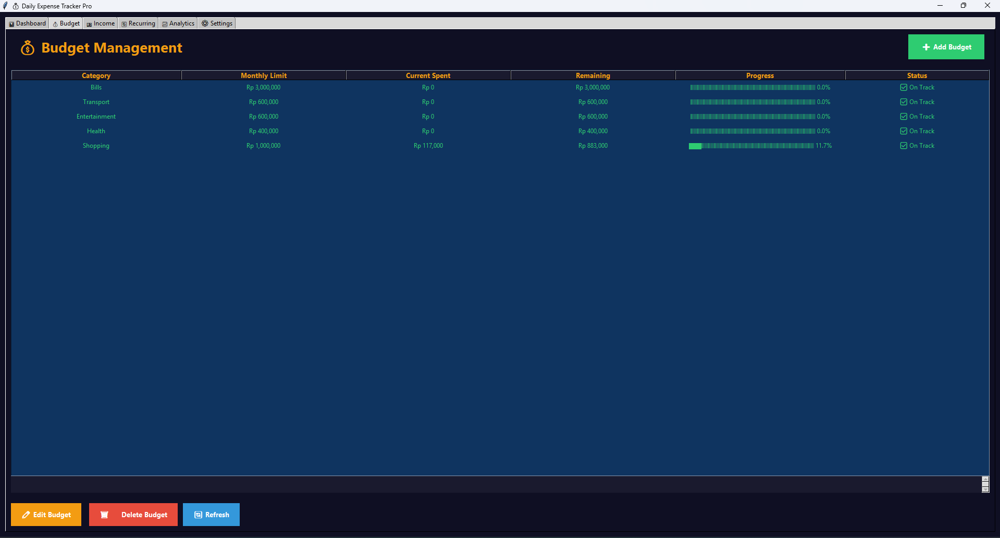 |

| Income Tracking | Recurring Expenses |
|-----------------|-------------------|
| 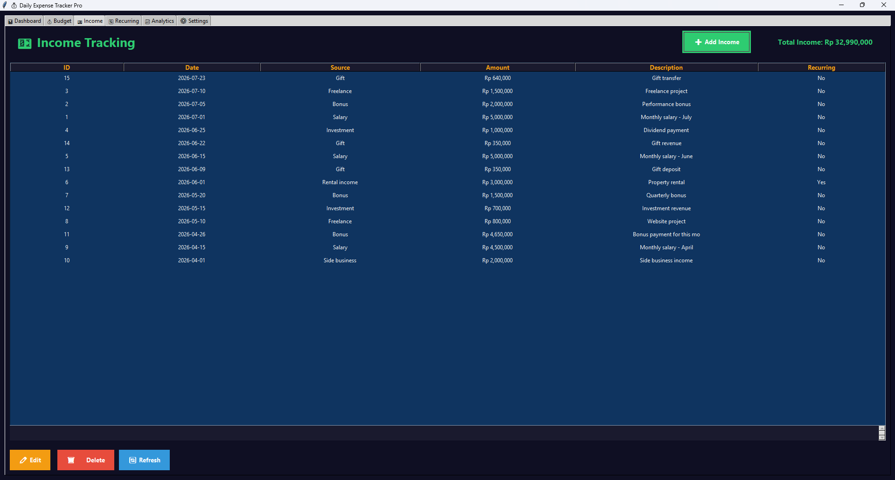 | 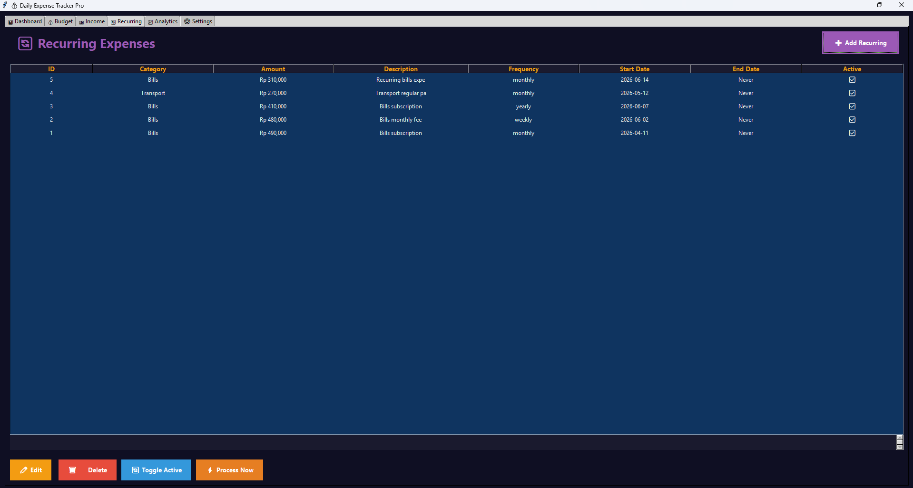 |

| Analytics | Settings |
|-----------|----------|
| 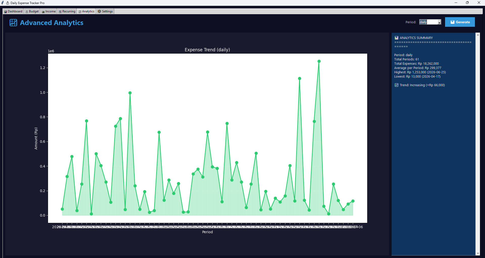 | 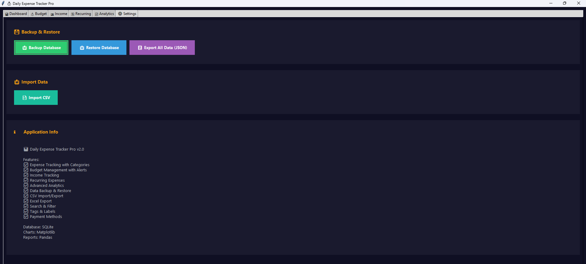 |

### 💻 CLI Interface

| Main Menu | View History |
|-----------|--------------|
| 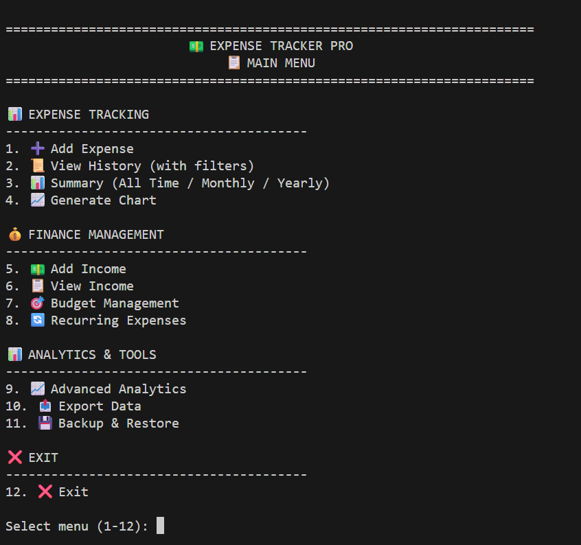 | 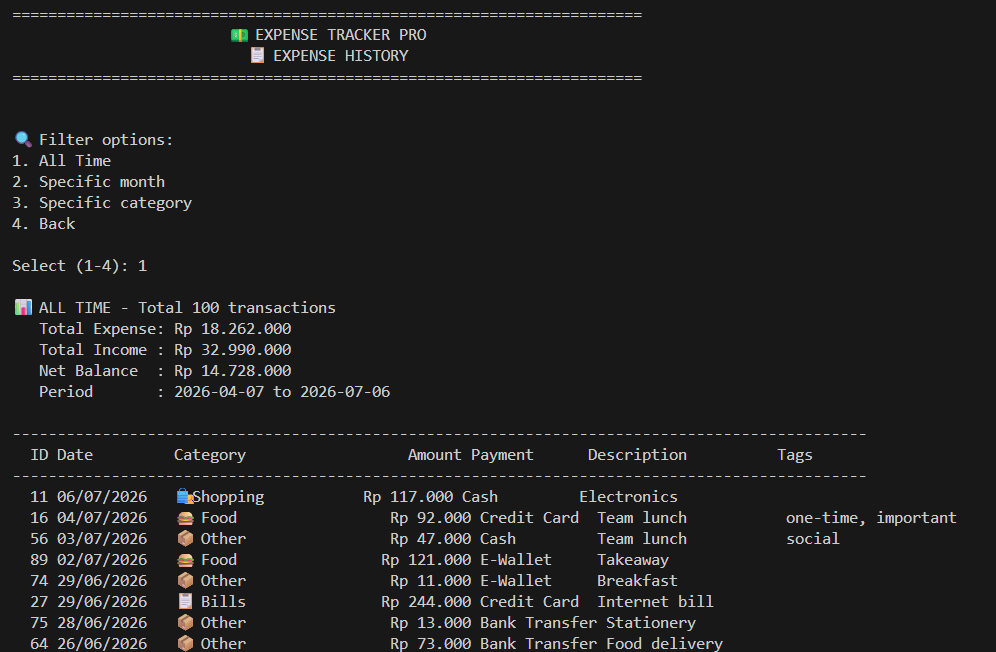 |

| All Time Summary | Generate Chart |
|------------------|----------------|
| 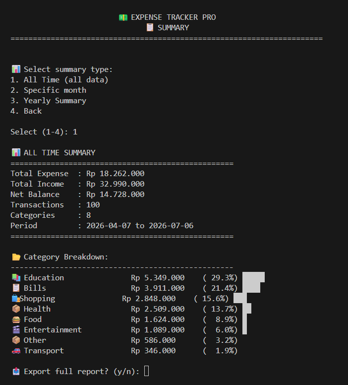 | 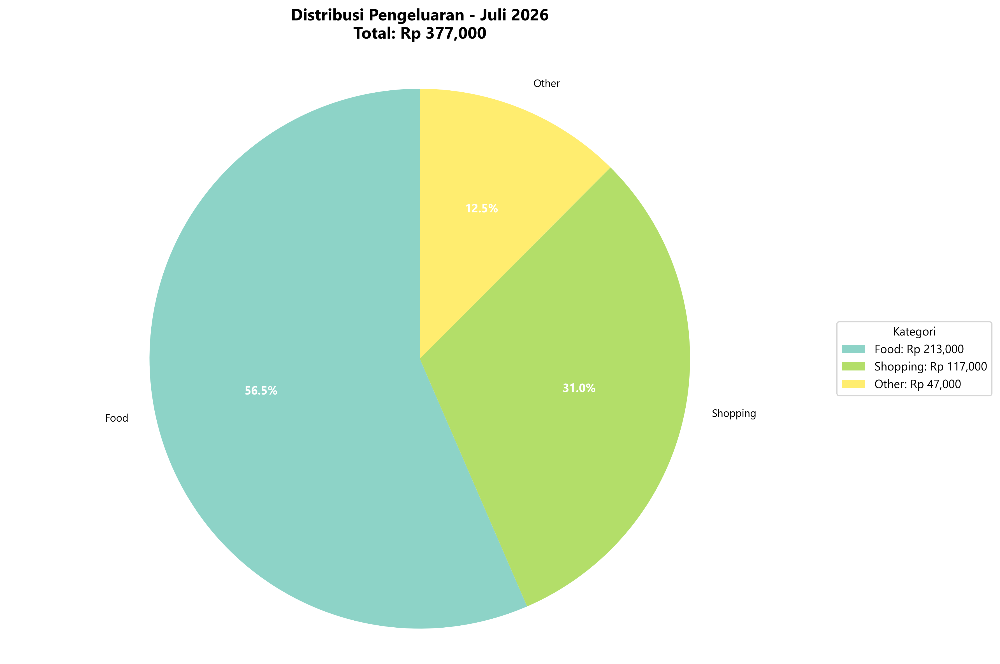 |

### 📊 Export & Testing

| Export Files | Test Results |
|--------------|--------------|
| 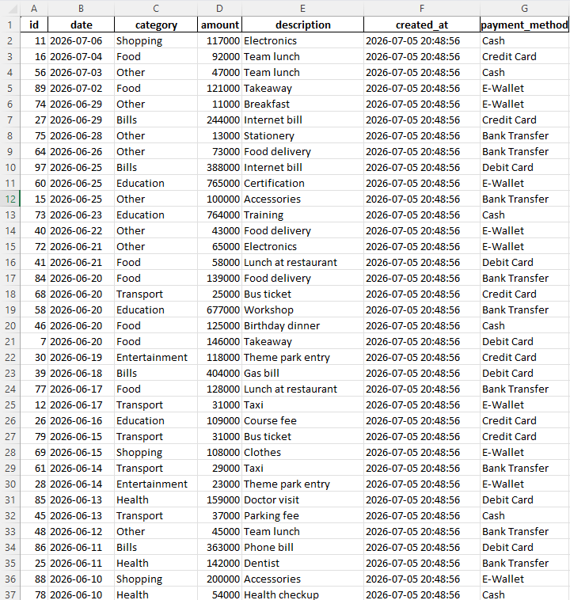 | 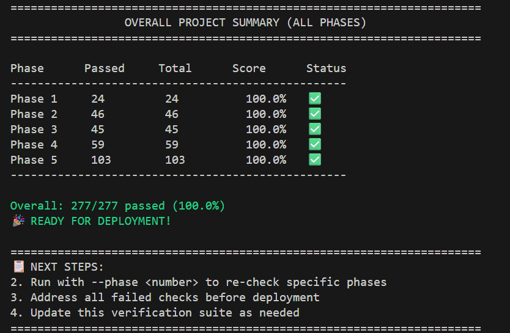 |

---

## 🧪 Development

### Running Tests

```bash
# Run all tests with coverage
pytest tests/ -v --cov=. --cov-report=html

# Run specific test module
pytest tests/test_database.py -v
pytest tests/test_expenses.py -v
pytest tests/test_export.py -v

# Run all verification phases
python phase-all-summary.py --phase=all
```

### Utility Scripts

```bash
# Check database structure and data
python check_db.py

# Reset database (delete all data)
python reset_db.py

# Generate dummy test data
python utils/dummy_data.py --preview

# Add manual income entries
python add_income.py
```

### Code Quality

```bash
# Format code with Black
black .

# Check code style with Flake8
flake8 .

# Sort imports with isort
isort .
```

---

## 📦 Dependencies

### Core Requirements

| Package | Version | Purpose |
|---------|---------|---------|
| matplotlib | 3.7.1 | Data visualization |
| pandas | 2.0.3 | Data processing and Excel export |
| openpyxl | 3.1.2 | Excel file manipulation |
| python-dateutil | 2.8.2 | Date parsing utilities |
| tkinter | Built-in | GUI framework |

### Development Dependencies

| Package | Version | Purpose |
|---------|---------|---------|
| pytest | 9.0.1 | Testing framework |
| pytest-cov | 7.0.0 | Coverage reporting |
| black | 24.10.0 | Code formatting |
| flake8 | 7.1.2 | Code linting |
| autopep8 | 2.0.0 | Auto-formatting |

---

## 🔮 Future Enhancements

1. **User Authentication** - Multi-user support with login system
2. **Cloud Sync** - Automatic backup to cloud services
3. **Web Interface** - Flask/FastAPI web application
4. **Mobile App** - Cross-platform mobile version
5. **Receipt Scanning** - OCR integration for automatic entry
6. **Bank Integration** - API connections for auto-import
7. **Advanced Analytics** - Predictive spending insights
8. **Multiple Currency** - Support for different currencies
9. **Dark/Light Theme** - Toggle between themes in GUI
10. **Export Filtering** - Export specific date ranges or categories

---

## 🤝 Contributing

Contributions are welcome! Please follow these steps:

1. **Fork the repository**
2. **Create a descriptive feature branch**:
   ```bash
   git checkout -b feature/feature-name
   ```
3. **Commit your changes with a clear message**:
   ```bash
   git commit -m 'Add: feature description'
   ```
4. **Push to your branch**:
   ```bash
   git push origin feature/feature-name
   ```
5. **Open a Pull Request**

### Development Guidelines

- Follow PEP 8 style guidelines
- Add tests for new functionality
- Update documentation accordingly
- Use descriptive commit messages
- Ensure your code passes all existing tests

---

## 📄 License

This project is available for educational and personal use. Commercial use requires permission.

---

## 🙏 Acknowledgments

- Built as a portfolio project to demonstrate Python development skills
- Inspired by the need for personal finance management tools
- Uses open-source libraries: Matplotlib, Pandas, OpenPyXL
- SQLite for lightweight local database storage

---

## 📧 Support

For issues or questions:
1. Check the existing documentation
2. Review the code comments
3. Create an issue in the [GitHub repository](https://github.com/ArkanTsabit123/Daily-Expense-Tracker/issues)
4. Contact: aarkantsabit@gmail.com

---

**Happy Tracking!** ⭐